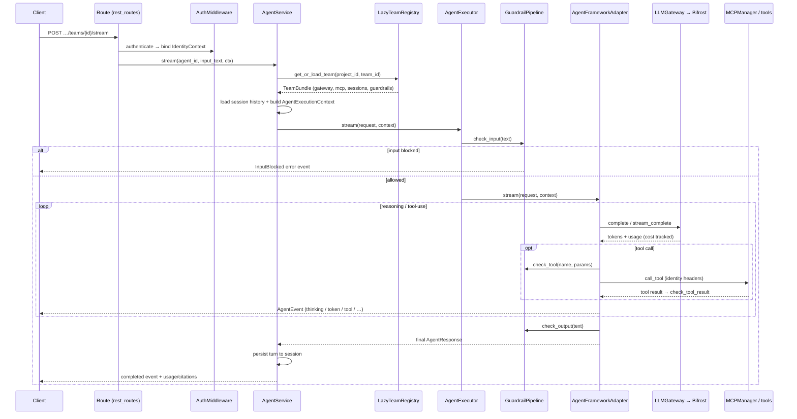

# agent-service-maf — Architecture

> **Status:** Living document · **Scope:** the `agent_service_maf` Python package shipped by `src/nemo/agent-service-maf/`
> **Audience:** engineers reviewing this service, integrators calling it, and anyone extending it with a new framework, orchestration, guardrail, or tool.

---

## 1. What this service is

`agent-service-maf` is a **pluggable, protocol-agnostic agent framework**. It exposes AI agents over a single, uniform contract regardless of which underlying agent library actually runs the reasoning loop. You define an agent once (as configuration + a thin adapter), and the framework handles routing, configuration merging, model selection, tool integration, guardrails, conversation memory, and the wire protocols clients use to reach it.

The design goal is **decoupling**: application code, callers, and operators should never need to know whether an agent is backed by the Microsoft Agent Framework, a custom echo adapter, or some future framework. The request shape, response shape, and streaming event format are identical across all of them. Swapping or adding a backend means writing one adapter file; nothing else changes.

Within the AgentStudio monorepo this is the modern, Python-based agent runtime (the `-maf` suffix = "multi-agent framework"). It runs alongside the rest of the platform, reuses **Bifrost** as its LLM gateway, and reads agent/team definitions either from local JSON files or from the central **config-service**.

### Core capabilities at a glance

- **One agent contract** (`AgentInterface`) implemented by every backend adapter.
- **Four access protocols** over one service: REST, Server-Sent Events (SSE), WebSocket, plus protocol adapters for **Chat** (session-aware), **Google A2A** (agent-to-agent), and **MCP server** (expose agents *as* MCP tools).
- **Eight multi-agent orchestration patterns** (single, sequential, concurrent, handoff, group_chat, magentic, triage, graph) on the Microsoft Agent Framework adapter.
- **A composable guardrail pipeline** (16 built-in guardrails) covering input, output, and tool phases.
- **Framework-agnostic MCP tool integration** with two-token identity propagation.
- **Three-tier configuration merge** (env → file → request) with file *or* remote (config-service) sources.
- **Multi-tenant, project-scoped** runtime with lazy per-team resource bundles.
- **Sync, streaming, and async (fire-and-forget) invocation** with Redis-backed session and task stores.

---

## 2. Design principles

The codebase is deliberately built around a small set of patterns. Recognising them makes the rest of the system predictable.

**Single mediator.** Every protocol adapter funnels through one class — `AgentService`. Adapters never touch the executor, gateway, or session store directly. This keeps protocol code thin and business logic in one place.

**Registry + decorator extensibility (Open/Closed).** Frameworks, guardrails, MCP transports, and function tools are all discovered through decorator-based registries (`@FrameworkRegistry.register`, `@GuardrailRegistry.register`, `TransportFactory`, `register_function`). Adding a new variant means adding a module and a decorator — no `if/elif` chains to edit. (Orchestration types are dispatched by `MafOrchestrationBuilder` to Agent Framework workflow builders.)

**Depend on interfaces, not implementations.** Callers that only invoke agents depend on the narrow `AgentInvoker` interface; the full `AgentInterface` adds lifecycle and capability methods. Stores (`SessionStore`, `TaskStore`), LLM clients (`HttpLLMClient`), and config sources (`ConfigSource`) are all ABCs/Protocols with in-memory and production implementations.

**Single Responsibility split.** Large subsystems are decomposed into focused classes — e.g. `MCPManager` is a façade over `MCPConnectionManager`, `MCPDiscovery`, `MCPToolInvoker`, and `MCPHealthCheck`; the MAF `MafAgentBuilder` delegates model resolution to `MafModelResolver`.

**Lazy, per-tenant resources.** Runtime resources live in a `TeamBundle` per team and are materialised on first request by the `LazyTeamRegistry`, with optional warm-up.

**All LLM traffic through one gateway.** Adapters MUST NOT call providers directly. The `LLMGateway` (and the MAF `BifrostChatClient` bridge) is the single egress point to Bifrost, which centralises cost tracking, model validation, and secret redaction. The bearer used on every outbound completion is the **per-project Bifrost virtual key** (resolved at bundle-load time by `ProjectVKResolver` against config-service, never a deployment-wide master key); a project whose VK can't be resolved fails fast with `MissingProjectVirtualKeyError` rather than silently degrading to a shared credential.

---

## 3. High-level architecture

```mermaid
flowchart TB
    subgraph clients[Clients]
        UI[Web UI / SDK]
        EXT[External agents / Claude Desktop]
        SVC[Sibling services]
    end

    subgraph interface[Interface Layer  &#40;FastAPI&#41;]
        REST[REST / SSE / WS routes]
        CHAT[Chat protocol]
        A2A[A2A protocol]
        MCPS[MCP server protocol]
        AUTH[Auth middleware]
    end

    SERVICE[AgentService  &#40;single mediator&#41;]

    subgraph framework[Framework Layer]
        REG[FrameworkRegistry]
        EXEC[AgentExecutor]
        GR[GuardrailPipeline]
        SK[AgentFrameworkAdapter<br/>+ 8 orchestrations]
        ECHO[EchoAdapter]
    end

    subgraph core[Core / Runtime]
        TR[LazyTeamRegistry → TeamBundle]
        SESS[SessionManager / SessionStore]
        TASK[TaskManager / TaskStore]
        ID[IdentityContext]
    end

    subgraph integ[Integrations]
        GW[LLMGateway → Bifrost]
        MCP[MCPManager → MCP servers]
        TOOLS[Tool bindings: function + MCP]
    end

    subgraph cfg[Configuration]
        CL[ConfigLoader  3-tier merge]
        FILE[FileConfigLoader]
        REMOTE[RemoteConfigCache → config-service]
    end

    clients --> interface --> AUTH --> SERVICE
    SERVICE --> EXEC
    EXEC --> REG --> SK & ECHO
    EXEC --> GR
    SK --> GW
    SK --> TOOLS --> MCP
    SERVICE --> TR
    TR --> SESS & TASK & GW & MCP
    SERVICE --> SESS & TASK
    cfg --> TR
    FILE & REMOTE --> CL
    ID -.propagated.-> MCP & GW
```



The system is layered top-to-bottom. Requests enter through the **interface layer**, are authenticated, and handed to the **`AgentService` mediator**. The mediator resolves the correct **`TeamBundle`** for the project/team, builds an execution context, and calls the **`AgentExecutor`**, which applies **guardrails** and dispatches to a **framework adapter**. The adapter runs the reasoning loop, calling the **`LLMGateway`** for completions and the **`MCPManager`/tool bindings** for tools. **Configuration** feeds the registry; **identity** is propagated outward to the gateway and MCP servers.

---

## 4. Layers and subsystems

### 4.1 Interface layer (`interface_layer/`)

The FastAPI surface. `api.py` builds the app (`create_app`) and owns the **lifespan** that wires the runtime at startup (see §6). Routes are **project-scoped** under `/api/v1/projects/{project_id}`. Protocol adapters under `protocols/` are thin translators between a wire format and `AgentService`; they hold no business logic.

| Protocol | Module | Purpose |
|---|---|---|
| REST / SSE / WS | `protocols/rest_routes.py`, `routes.py`, `sse_handler.py`, `ws_handler.py` | Synchronous invoke, streamed events, bidirectional sessions |
| Chat | `protocols/chat_routes.py` | Session-aware conversational endpoints with automatic server-side memory |
| Google A2A | `protocols/a2a_routes.py`, `a2a_models.py`, `a2a_task_manager.py` | Agent Card discovery + JSON-RPC task lifecycle per the A2A spec |
| MCP server | `protocols/mcp_server.py` | Exposes this service's agents **as** MCP tools to external callers |

**Representative endpoints** (project prefix `/api/v1/projects/{project_id}`):

```
POST   …/teams/{team_id}/invoke              # sync, explicit team (modern API)
POST   …/teams/{team_id}/stream              # SSE
WS     …/agent-teams/{team_id}/ws            # WebSocket
POST   …/agents/{agent_id}/invoke            # sync, default-team alias
POST   …/agents/{agent_id}/invoke/async      # fire-and-forget (returns task id)
GET    …/tasks/{task_id}                     # poll async task status/result
GET    …/teams                               # list teams in project
GET    …/agents                              # list registered frameworks + capabilities
GET    …/agents/{agent_id}/capabilities      # self-describe
GET    /.well-known/agent.json               # A2A Agent Card
GET    /health                               # liveness (un-prefixed)
GET    /ready                                # readiness (dependency checks)
```

Supporting pieces: `auth.py` (pluggable `AuthMiddleware` — noop, API key, gateway-identity, or agent auth), `error_formatter.py` (scrubs stack traces/internal detail from client errors in production), `models.py` (wire models, all camelCase via `CamelCaseModel`), `_attachments.py` (attachment validation).

### 4.2 The mediator — `AgentService` (`core/service.py`)

The **only** entry point protocol adapters use. It owns the `SessionManager`, builds the per-invocation `AgentExecutionContext` (`_build_context`), delegates execution to the `AgentExecutor`, and exposes `invoke`, `stream`, `list_agents`, `get_agent_capabilities`, `get_session_history`, and `clear_session`. Keeping this as the single choke point means session handling, context construction, and tracing live in one place rather than being duplicated across four protocols.

### 4.3 Framework layer (`framework/`)

This layer turns a resolved config + request into agent output.

- **`AgentInterface` / `AgentInvoker`** (`core/interfaces.py`) — the universal contract every adapter implements: `invoke`, `stream`, `get_capabilities`, `initialize`, `shutdown`. Also defines the shared wire types: `AgentRequest`, `AgentResponse`, `AgentEvent` (+ `EventType` registry), `TokenUsage`, `Citations`, `ToolExecution`, `AgentTraceStep`, etc. This is the contract that makes the whole system protocol- and framework-agnostic.
- **`BaseAgent`** (`framework/base_agent.py`) — common boilerplate all adapters subclass.
- **`FrameworkRegistry`** (`framework/registry.py`) — class-level map from framework name → adapter class. Adapters self-register at import time via `@FrameworkRegistry.register("name")`. Also manages startup/shutdown **lifecycle hooks**.
- **`AgentExecutor`** (`framework/executor.py`) — resolves the adapter from the registry, applies the guardrail pipeline, and runs `invoke`/`stream`. Primary programmatic entry point used by `AgentService`.
- **`ResponseBuilder`** (`framework/response_builder.py`) — aggregates a stream of `AgentEvent`s into a final `InvokeResponse`, including parsed structured output.

**Adapters shipped today:** `EchoAdapter` (deterministic, dependency-free, for tests/reference) and the **Microsoft Agent Framework adapter**.

#### Microsoft Agent Framework adapter (`framework/maf/`)

Registered as `"maf"`. This is the production reasoning backend and the default framework.

- `adapter.py` — `AgentFrameworkAdapter`: single-agent and multi-agent invoke/stream, output-schema handling, citation building, tool execution, wall-clock timeout enforcement.
- `agent_builder.py` — builds AF `Agent`s from config (`MafModelResolver`, `MafAgentBuilder`).
- `gateway_chat_client.py` — `BifrostChatClient`: the critical bridge that routes **all** LLM calls through `LLMGateway` so AF never talks to a provider directly.
- `orchestration_builder.py` — `MafOrchestrationBuilder`: maps config orchestration types to AF workflow builders.
- `tools.py` — converts MCP tools and Python function bindings into AF tools (with auth-hook gating and citation-recording wrappers).
- `event_mapper.py` — maps AF results/tool history into framework `AgentEvent`s.
- `observability.py` — wires AF's OpenTelemetry instrumentation when `semantic_kernel.enable_telemetry` is set.

**Orchestration patterns** (see §7): `single`, `sequential`, `concurrent`, `handoff`, `group_chat`, `magentic`, `triage`, `graph`.

### 4.4 LLM gateway (`gateway/`)

The single egress for all model traffic.

- **`LLMGateway`** (`llm_gateway.py`) — `complete`, `stream_complete`, and `complete_with_tools` (a multi-round tool-use loop). Validates the requested model against the catalog and builds normalised responses.
- **`HttpLLMClient` / `BifrostClient`** (`http_llm_client.py`) — Protocol + httpx implementation pointed at the Bifrost proxy; decouples the gateway from the transport.
- **`ProjectVKResolver`** (`project_vk_resolver.py`) — resolves the **per-project Bifrost virtual key (VK)** at bundle-load time by calling `GET {CONFIG_SERVICE_URL}/api/v1/projects/{pid}/models/{model_id_hint}` and reading `gatewayApiKey` from the response. Caches resolved VKs in a `TTLCache` keyed on `project_id` (60s default). The `team_loader` pipes the resolver into every `TeamBundle` build so each bundle's `LLMGateway` carries that project's bearer — there is no fallback to a deployment-wide master key. A failed lookup raises `MissingProjectVirtualKeyError` and the bundle is marked unhealthy; this is intentional, so a missing VK can't silently bypass per-project rate-limits/budgets on Bifrost. The `model_id_hint` is any model UUID known to belong to the project (`_extract_vk_model_hint` in `team_loader.py` pulls one off the resolved agent record before the MAF adapter rewrites the field).
- **`UsageTracker`** (`cost_tracker.py`) — passive per-session token/cost observer fed by Bifrost's usage payloads.
- **`ToolExecutionStrategy`** (`tool_strategy.py`) — pluggable interface so the tool-use loop isn't hard-coded to one tool source.
- **`SecretRedactor`** (`secret_redactor.py`) — a structlog processor that masks credentials in **all** log output.

### 4.5 Guardrails (`guardrails/`)

A composable, async safety pipeline that runs in three phases — **input**, **output**, and **tool**.

- **`GuardrailPipeline`** (`pipeline.py`) — runs ordered guardrails per phase (`check_input`, `check_output`, `check_tool`). Supports **fail-open** mode (errors in a guardrail don't block traffic) vs fail-closed.
- **`GuardrailRegistry`** (`registry.py`) — Open/Closed registry; guardrails register by name and are instantiated from `GuardrailSection` config.
- **`base.py`** — `GuardrailContext`, `GuardrailResult`, `GuardrailAction`, and the three ABCs (`InputGuardrail`, `OutputGuardrail`, `ToolGuardrail`).

**Built-in catalog (19):** `input_validator`, `prompt_injection`, `adversarial_unicode`, `language`, `pii_masker`, `phi_masker`, `pci_masker`, `secret_leakage`, `custom_regex`, `word_blocklist`, `content_filter`, `output_length`, `output_sanitizer`, `schema_validator`, `system_prompt_leakage`, `tool_authorizer`, `tool_call_counter`, `tool_param_validator`, `tool_result_guardrail`. Guardrails with optional dependencies (e.g. `secret_leakage` → `detect-secrets`) import them lazily and only when enabled.

### 4.6 MCP integration (`mcp/`) and tools (`tools/`)

Framework-agnostic MCP connectivity — it does **not** import any agent library, so the same tool catalog is reusable across adapters.

- **`MCPManager`** (`mcp_manager.py`) — façade over connection lifecycle, discovery, invocation, and health (`connect`, `connect_all`, `call_tool`, `list_tools`, `check_health`).
- **`MCPConnectionManager`** — owns the per-server `ClientSession` cache and (new) a `get_config(server_name)` lookup so discovery and invocation can read per-server fields like `gateway_server_name`.
- **`ToolRegistry`** (`tool_registry.py`) — aggregated catalog of discovered tools (`ToolSchema`, `ToolResult`).
- **`TransportFactory`** (`transport_factory.py`) — registry-based transport builder (Open/Closed; add a transport without editing the factory).
- **`_identity_transport.py`** — `IdentityAwareHTTPTransport` and helpers that stamp the **two-token** identity headers on outbound MCP calls (see §9.1).

**Two MCP transport models** are supported transparently by the same `MCPManager`, selected per-server by the presence of `MCPServerConfig.gateway_server_name`:

- **Direct-session mode** (`gateway_server_name` is `None`) — file-source fixtures and any deployment where each MCP server is reachable at its own URL. One `MCPServerConfig` ↔ one upstream URL ↔ one session ↔ that session's tools. Tools are attributed via the `ClientSessionGroup`'s `_tool_to_session` reverse index. The legacy/local-dev path.
- **Bifrost-multiplexed mode** (`gateway_server_name` is set) — config-service records resolved through `mcp_server_record_to_inline_config`. Bifrost serves a **single aggregated `/mcp` endpoint** that proxies every registered MCP client behind one URL; tool names come back name-prefixed with the Bifrost client name (`projXY_weather-get_forecast`). `derive_mcp_base_url` strips the full `/litellm/v1` OpenAI-compat subpath so the proxy URL lands at the gateway root. Each `MCPServerConfig` still gets its own session to that same `/mcp` URL; `MCPDiscovery.discover_server` filters `group.tools` to entries whose name starts with `f"{gateway_server_name}-"` and **strips the prefix** when registering — so the LLM sees clean tool names (`get_forecast`), per-agent tool isolation is preserved (agents only see their own server's prefix), and tools from sibling Bifrost clients sharing the aggregated endpoint never leak in. On dispatch, `MCPToolInvoker.call_tool` **re-prefixes** the bare tool name with `<gateway_server_name>-` before calling the group, so Bifrost can route the call back to the right upstream client.

**Tool bindings (`tools/`)** unify the two ways an agent calls a tool behind one addressable list:

- `FunctionBinding` (`type="function"`) — a registered Python callable referenced by `function_ref`; dispatched by `FunctionToolProvider`. The shipped example is `kb_retrieve` (knowledge-base retrieval, with chunk/name sanitisation). Two operational details that are easy to miss:
  - **Endpoint templating.** `KB_ENDPOINT_URL` may contain `{projectId}` and `{kbId}` placeholders; `kb_retrieve` substitutes them at call time. The same MAF binary therefore talks to either Cloud APIM's body-based `…/retrieval/invoke` (no placeholders) **or** the in-cluster Rust `kb-retrieval-service`'s path-based `/api/v1/projects/{projectId}/knowledgebases/{kbId}/search` (placeholders in env) without a build switch.
  - **Dual-key threshold body.** When `params.similarityThreshold` is set, the outbound request body emits **both** `similarityThreshold` (Cloud APIM key) and `minScore` (in-cluster Rust key). Both upstreams tolerate unknown JSON keys, so one binary works against either deployment.
  - **Per-agent overrides via `ragConfig`.** The team-loader's `_rag_signature_for(agent_record, kb_id)` extracts the agent's per-KB ragConfig (`topK`, `similarityThreshold`, `similarityThresholdEnabled`, `searchMode`) into a hashable signature; `knowledge_base_record_to_function_binding` takes these as `rag_overrides` and bakes them into the binding's pinned `params`. Agents in the same team that share an identical signature for the same KB share one synthesised binding; agents with **divergent** signatures get **variant bindings** suffixed `__r2`, `__r3`, … — the first-seen group keeps the bare binding name, and each agent's `tool_bindings` list references only its own variant so the LLM never sees a foreign agent's settings.
- `MCPBinding` (`type="mcp"`) — a tool served by an MCP server.

### 4.7 Core runtime (`core/`)

The foundational types and stateful machinery.

- **Multi-tenancy:** `TeamBundle` holds all runtime resources for one team (its config, gateway, MCP manager, session manager, task manager, guardrail pipeline). `LazyTeamRegistry` (`team_registry_lazy.py`) materialises bundles on first access from a pluggable `ConfigSource`, with per-key locks, eviction, and project-scoped lookups. `team_loader.py` builds a bundle from a file, a team blob, or a single agent record — and threads a `ProjectVKResolver` into every build so each bundle's `LLMGateway` is authenticated with that project's Bifrost virtual key (see §4.4). The single-agent path (`build_team_bundle_from_agent`, used by `POST /agents/{agent_id}/invoke`) wraps the agent in a synthetic one-member team blob and delegates to `build_team_bundle_from_team_blob`, so MCP-server + KB resolution and the prefix-isolation logic in §4.6 apply identically regardless of whether the caller named a team or a single agent.
- **Sessions / memory:** `Session`, `SessionManager`, and the `SessionStore` ABC with `InMemorySessionStore` and `RedisSessionStore`. Memory buffering strategies (`memory_buffer.py`): `SlidingWindowBuffer` and `SummaryBuffer`, with TTL expiry and token budgets.
- **Async invocation:** `Task`, `TaskStatus`, `TaskManager`, and the `TaskStore` ABC (in-memory / Redis). Background work runs via `asyncio.create_task` with strong references held in-flight; a **two-tier TTL** keeps running tasks ~10 min and completed results ~1 h; graceful shutdown marks in-flight tasks failed (see `docs/design/async-invoke.md`).
- **Execution context:** `AgentExecutionContext` (`context.py`) — the DI container passed to every adapter invocation.
- **Identity:** `IdentityContext` (`identity.py`) — the single source of truth for *who* a request is for, bound via ContextVar (`get/set/reset_current_identity`).
- **Readiness:** `ReadinessChecker` (`readiness.py`) backs `GET /ready`; `/health` is pure liveness.
- **Redis:** `redis_factory.py` centralises async client construction (Sentinel HA or standalone URL) shared by both stores.

### 4.8 Configuration (`config/`)

Three-tier merge with a strict priority order (later wins): **defaults → JSON file → request overrides** (and env vars seed the lowest tier).

- **`ConfigLoader`** (`config_loader.py`) — performs the deep merge.
- **`validators.py`** — the full Pydantic schema. The root `AgentConfig` composes typed sections: `agent`, `interface`, `gateway`, `guardrails` (`GuardrailSection`/`GuardrailRule`/`ToolPolicy`), `mcp`, `memory`, `tasks`, `logging`, `auth`, `streaming`, `readiness`, and `semantic_kernel` (`SKAgentDefinition`, `OrchestrationConfig`, `HandoffDefinition`, selection/termination strategies, `GraphEdge`).
- **Source selection** (chosen at startup by `CONFIG_SOURCE` / `remote_enabled`):
  - **File** — `FileConfigLoader` reads local `configs/` JSON (the testing/standalone path; the universe of teams is known synchronously).
  - **Remote** — `RemoteConfigCache` is a TTL-cached HTTP fetcher against **config-service**, authenticated via Keycloak client-credentials (`ServiceAccountClient`). `remote_adapter.py` translates config-service records (agent record, MCP server record, KB record, team blob) into MAF's nested `AgentConfig` shape. The translator is deliberately **loud-failure**: `agent_record_to_sk_agent` raises `ValueError` when the resolved `model` dict is missing `gatewayModelId` instead of silently falling back to `providerModelId` or a raw UUID, since either fallback would result in a confusing 404 at Bifrost rather than an actionable startup error. This mirrors the `ProjectVKResolver` stance in §4.4 — both refuse to paper over a bad config-service state.
- **Per-request overrides:** `_override_applier.py` translates request-level `ConfigOverrides` into `AgentConfig` mutations, validated against the model catalog.

---

## 5. Request lifecycle

A synchronous, streaming invocation through the MAF adapter:



For **async** invocation, the route returns a task id immediately; `TaskManager` runs the same inner logic in the background and the client polls `GET …/tasks/{task_id}`.

---

## 6. Startup / lifespan wiring

`api.py`'s `lifespan` performs the boot sequence:

1. Read `settings` and decide the **config source**: if `remote_enabled`, construct `ServiceAccountClient` (Keycloak) + `RemoteConfigCache`; otherwise `FileConfigLoader` (with a warning if `CONFIG_SOURCE=remote` but no URL is set, or file-mode env is half-configured).
2. In remote mode, construct a **`ProjectVKResolver`** (sharing the service-account client) so every `TeamBundle` build can fetch its project's Bifrost VK from config-service.
3. Wrap the source in a **`LazyTeamRegistry`**, passing the VK resolver alongside the source's `get_agent` / `get_mcp_server` / `get_knowledge_base` callbacks. The registry threads these into `build_team_bundle_from_team_blob` *and* `build_team_bundle_from_agent` so MCP-server inlining, KB → `kb_retrieve` FunctionBinding synthesis (with per-agent `ragConfig` overrides), and per-project VK injection all happen for both team and single-agent invokes.
4. Register a `_post_build_lifecycle` hook on the registry: for every newly materialised bundle, connect MCP servers (or skip when `mcp.lazy_connect=true`, deferring connect to first tool call) and start the bundle's `TaskManager`. A bundle that fails MCP connect or VK resolution is marked unhealthy and excluded from serving.
5. Apply the `AGENT_DEFAULT_TEAM` override **before** any materialisation so the operator's chosen default wins over the implicit "first added" default.
6. Optionally **warm up** teams listed in `AGENT_WARM_TEAMS` (and, in file mode, every discovered team — preserving the pre-migration eager-registration semantics) so MCP/task managers are ready before traffic.
7. Register the `FrameworkRegistry`, store everything on `app.state`, run framework startup hooks, and yield. Shutdown tears down in reverse: tasks → sessions → MCP, with the gateway owned and closed by each bundle.

---

## 7. Orchestration patterns

The MAF adapter supports eight orchestration types, selected by `semantic_kernel.orchestration.type` and built by the `MafOrchestrationBuilder`:

| Type | Behaviour |
|---|---|
| `single` | One agent handles the request. |
| `sequential` | Agents run in a fixed pipeline; each consumes the previous output. |
| `concurrent` | Agents run in parallel; results are aggregated. |
| `handoff` | An agent can transfer control to another via `transfer_to_*` tool calls. |
| `group_chat` | Multiple agents converse under a selection + termination strategy. |
| `magentic` | Autonomous manager-driven planning across agents. |
| `triage` | A router agent picks exactly one specialist per request (see `configs/team/triage_router.json`). |
| `graph` | Explicit DAG of agents defined by `GraphEdge`s. |

Every orchestration honours a `termination_strategy` (six types, e.g. max-iterations / keyword / custom) enforced by the `TerminationWatcher` in `termination.py`. Ready-to-run examples for each pattern live under `configs/team/`.

---

## 8. Configuration model

A team config (schema `2.0.0`) is a single JSON document. Skeleton:

```jsonc
{
  "_schema_version": "2.0.0",
  "project_id": "…",
  "agent":      { "framework": "maf", "model": "azure/gpt-4.1-mini",
                  "temperature": 0.7, "max_tokens": 4096, "timeout_seconds": 300 },
  "semantic_kernel": {
    "agents": [ { "name": "router", "instructions": "…", "model": "…",
                  "tools": [], "mcp_servers": [], "function_choice_behavior": "auto" } ],
    "orchestration": { "type": "triage", "termination_strategy": { … } }
  },
  "gateway":    { "url": "http://bifrost:8080/v1", "default_model": "…" },
  "guardrails": { "enabled": true, "fail_open": false, "input": [ … ], "output": [ … ], "tool_policy": { … } },
  "mcp":        { "lazy_connect": true, "mcp_servers": [ … ] },
  "memory":     { "backend": "redis", "buffer": "summary_buffer", … },
  "tasks":      { "backend": "redis", "running_ttl": 600, "result_ttl": 3600 }
}
```

`gateway.api_key` is intentionally omitted from this skeleton: in remote mode the bearer is the **per-project Bifrost virtual key** resolved at bundle-load time (see `ProjectVKResolver` in §4.4) and any value in JSON would be overwritten. File-mode standalone deployments may still set it explicitly for back-compat with non-Bifrost gateways.

Agent records under `semantic_kernel.agents[]` may additionally carry `ragConfig` keyed by knowledge-base id — `{"<kbId>": {"topK": 5, "similarityThreshold": 0.3, "searchMode": "hybrid", "similarityThresholdEnabled": true}}` — which the team-loader bakes into the synthesised `kb_retrieve` FunctionBinding's pinned params (see §4.6).

Precedence at request time: **request overrides > file/remote config > defaults (env-seeded)**. The merge is deep, so a request can tweak one nested field without replacing the whole section. Reference files: `configs/agent_config.reference.json` / `.yaml`, and one example per feature under `configs/team/`.

---

## 9. Cross-cutting concerns

### 9.1 Identity propagation (two-token model)

`IdentityContext` is bound from the inbound request (auth middleware) into a ContextVar that travels with the async call chain. On outbound MCP calls, `IdentityAwareHTTPTransport` stamps a two-token header set (`build_identity_headers` / `build_identity_meta`) so downstream MCP servers can authorise on behalf of the original caller rather than the service account. This makes the service a faithful identity relay, not an authority-laundering proxy.

### 9.2 Observability and logging

Logging is structured (structlog), configured at startup by the shared in-repo `observability_client_runtime` SDK — the same package config-service, kb-retrieval-service, and the workers use — which adds OTel `trace_id`/`span_id` injection, an ASGI trace middleware, and OTLP trace/metric/log export. The `SecretRedactor` processor is spliced in just before the renderer so it masks credentials across all output on every code path. `UsageTracker` records per-session token/cost from Bifrost. When the SDK is absent (a bare local `pip install -e .`), logging degrades to a structlog-only fallback that keeps JSON output, `SecretRedactor`, and contextvar merging (no OTel traces/metrics).

### 9.3 Error handling

A typed exception hierarchy rooted at `AgentFrameworkError` (`core/exceptions.py`) covers configuration, invocation, timeout, auth, validation, streaming, MCP, gateway, rate-limit, session, A2A-task, protocol, and guardrail (`InputBlocked`/`OutputBlocked`/`ToolUnauthorized`) errors. `SafeErrorFormatter` strips stack traces and internal detail from client-facing responses in production mode.

### 9.4 Health vs readiness

`GET /health` is a liveness probe (200 once the process is up). `GET /ready` runs dependency checks via `ReadinessChecker` and reports *why* the service is or isn't ready — used to gate traffic in Kubernetes.

---

## 10. Deployment

| Concern | Value |
|---|---|
| Container port | `8000` (host `8001` in the integrated stack — TS `agent-service` owns host `8000`) |
| LLM gateway | Bifrost, e.g. `http://bifrost:8080/v1` |
| Session/Task state | dedicated Redis (e.g. host `6380`) |
| Image | `deploy/Dockerfile` |
| Config in image | `/app/configs/agent_config.json`; `PYTHONPATH=/app/src` |
| Python | 3.11+ (3.12+ for local dev), packaged with `hatchling`, locked with `uv` |
| Entry point | `agent-server = agent_service_maf.interface_layer.api:main` |

Run inside the monorepo via `make stack-up-build`, or standalone via `pip install -e ".[dev,agent-framework]"` + `make dev`. The `[agent-framework]` extra (`agent-framework-core` + `-orchestrations` + pinned protobuf) is required for the `maf` adapter; `[guardrails-secrets]` (detect-secrets) enables the secret_leakage guardrail. See `README-DEVELOPMENT.md` and `.env.example`.

---

## 11. Extension points

Because everything is registry-driven, extending the framework is local and additive:

- **New agent framework** → subclass `BaseAgent`, implement `AgentInterface`, decorate with `@FrameworkRegistry.register("name")`. Route through `LLMGateway`.
- **New orchestration** → add a branch in `MafOrchestrationBuilder` mapping the config `type` to an Agent Framework workflow builder.
- **New guardrail** → subclass an `InputGuardrail`/`OutputGuardrail`/`ToolGuardrail`, register via `@GuardrailRegistry.register("name")`, reference it in config.
- **New MCP transport** → register a parameter builder with `TransportFactory`.
- **New function tool** → register a callable with `register_function`, reference it from a `FunctionBinding`.
- **New config source** → implement the `ConfigSource` protocol; the `LazyTeamRegistry` consumes it unchanged.

In every case, no existing dispatch code is edited — the Open/Closed principle holds across the system.

---

## 12. Directory map

```
src/agent_service_maf/
├── interface_layer/     FastAPI app, routes, protocols (REST/SSE/WS, Chat, A2A, MCP server), auth
├── core/                contract (interfaces), AgentService, context, sessions, tasks, team bundles/registry, identity, readiness, exceptions
├── framework/           BaseAgent, registry, executor, response builder
│   └── maf/             Microsoft Agent Framework adapter, agent builder, gateway bridge (BifrostChatClient), orchestration builder, tools, event mapper, observability
├── gateway/             LLMGateway, Bifrost client, cost tracker, tool strategy, secret redactor
├── guardrails/          pipeline, registry, base, catalog/ (16 guardrails)
├── mcp/                  MCPManager, tool registry, transport factory, identity transport
├── tools/               unified bindings (function + MCP), functions/ (kb_retrieve)
├── config/              3-tier loader, validators, file + remote (config-service) sources, overrides
└── examples/            EchoAgent reference adapter

configs/                 reference config + one example team per feature (configs/team/*.json)
docs/                    this file, async-invoke design, config-service migration docs
deploy/ · docker/        Dockerfile and compose assets
tests/                   unit / integration / e2e
```

---

## 13. Glossary

- **MAF** — Multi-Agent Framework; the name of this service (`agent-service-maf`).
- **Adapter** — a class implementing `AgentInterface` for one underlying framework (e.g. Microsoft Agent Framework).
- **TeamBundle** — the per-team set of runtime resources (config, gateway, MCP, sessions, tasks, guardrails).
- **Team / Agent** — a "team" is one config document (one or more agents + orchestration); an "agent" is one participant within it.
- **Bifrost** — the external LLM gateway/proxy all completions route through.
- **config-service** — the central service that stores agent/team/MCP/KB definitions in remote mode.
- **Orchestration** — how multiple agents in a team coordinate (single, sequential, concurrent, handoff, group_chat, magentic, triage, graph).
- **Guardrail** — a composable input/output/tool-phase safety check.
- **MCP** — Model Context Protocol; how external tools are discovered and invoked.

---

*Source of truth is the code under `src/agent_service_maf/`. When behaviour and this document disagree, fix the document. For deeper specs see `README-REQUIREMENTS.md`, `README-DEVELOPMENT.md`, and `docs/design/`.*
