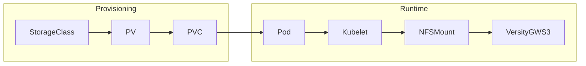
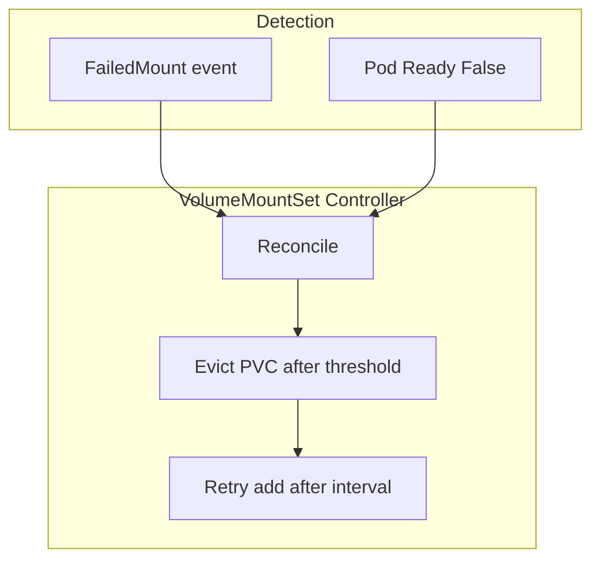

# NFS Mount Resilience

This document describes NFS mount options, the end-to-end mounting process, failure handling, and the defense-in-depth resilience mechanisms used when s3gateway backs object storage with NFS volumes (via PVCs).

---

## 1. NFS Mount Options Reference

### Supported options

| Option | Description | Default (platform) | Notes |
|--------|-------------|--------------------|------|
| `soft` | Return error to application after retries instead of blocking indefinitely | Injected by platform | Fail-fast; can cause EIO on writes during server outages. |
| `hard` | Retry NFS requests indefinitely (kernel blocks until server responds) | — | Use only when you accept indefinite hangs; overrides platform `soft` if set explicitly. |
| `timeo=N` | Timeout in deciseconds (0.1s) per NFS RPC before retry | `timeo=50` (5s) | Under NFSv4, kernel may use adaptive retransmission; value is a hint. |
| `retrans=N` | Number of retries before failure (soft) or continued retry (hard) | `retrans=3` | With soft: ~(timeo × retrans) seconds before EIO. |
| `noac` | Disable attribute cache; improves consistency across clients | Default for static PVs when no options given | Recommended for multi-pod s3gateway. |
| `nfsvers=N` | NFS version (3, 4, 4.0, 4.1, 4.2) | Set by StorageClass (e.g. 4.0 for Trident NAS) | — |
| `nolock` | Disable NLM locking | Used in Trident NAS StorageClass | Common for NFSv4. |

### Best practices (Kubernetes / containerized NFS)

- Prefer **soft** mounts for s3gateway so that unreachable NFS servers do not hang pods indefinitely; combine with application-level timeouts (boto3, Temporal).
- Use **timeo** and **retrans** to bound how long the kernel blocks per RPC (~15–25s with timeo=50, retrans=3).
- Use **noac** when multiple pods (e.g. s3gateway replicas) read/write the same NFS share for better consistency.
- For **hard** mounts: only when you need strict write durability and accept that a down NFS server can block I/O forever.

### NFSv3 vs NFSv4

- **NFSv3:** `timeo` and `retrans` are the primary controls for retry timing.
- **NFSv4:** The kernel may use adaptive retransmission; `timeo` is advisory. The **soft** flag still determines whether the kernel returns an error after retries or blocks indefinitely.

### soft vs hard trade-offs

| | soft | hard |
|---|------|------|
| Server unreachable | Application gets EIO after timeo×retrans | Kernel blocks until server responds |
| Write durability | Transient failure can yield EIO → risk of partial/corrupt writes | Writes are retried until server is back |
| Operational risk | Pods and activities can fail fast and be retried/evicted | Pods and threads can hang indefinitely |

For s3gateway (read-mostly, VersityGW buffering/retry), **soft** is the platform default to avoid indefinite hangs; explicit **hard** is respected when set by the user.

---

## 2. Platform Auto-Injected Options

### What the platform adds

For **static NFS PVs** (built by storage-manager PVBuilder), the platform **always merges** these options into the final mount options unless the user overrides them:

- **soft** — Injected unless the user has set **soft** or **hard** (explicit **hard** is respected).
- **timeo=50** — Injected unless the user has set any `timeo=*` option.
- **retrans=3** — Injected unless the user has set any `retrans=*` option.

For **dynamic provisioning** (Trident ONTAP/FSxN NAS StorageClass), the same options are set in the StorageClass `mountOptions` (see `scripts/configure-ontap-storage.sh`).

### Override behavior

- User options (e.g. from `agentstudio.io/mount-options` on the StorageClass) are parsed first.
- Options are matched by **key** (e.g. `timeo`, `retrans`); user value wins when present.
- If the user sets **hard**, the platform does **not** add **soft**.

### Behavior matrix (static PVs)

| User annotation | Final mount options |
|-----------------|----------------------|
| (none) | `noac`, `soft`, `timeo=50`, `retrans=3` |
| `noac,nfsvers=4.1` | `noac`, `nfsvers=4.1`, `soft`, `timeo=50`, `retrans=3` |
| `noac,hard` | `noac`, `hard`, `timeo=50`, `retrans=3` |
| `noac,soft,timeo=100` | `noac`, `soft`, `timeo=100`, `retrans=3` |

---

## 3. End-to-End Mounting Process

### Lifecycle (high level)

- **Static provisioning:** StorageClass (with optional `agentstudio.io/mount-options`) → PVBuilder creates PV with NFS spec + merged mount options → PVC binds to PV → Pod (s3gateway) schedules → kubelet mounts NFS on the node → VersityGW serves S3 over the mounted path.
- **Dynamic provisioning (Trident):** StorageClass (with `mountOptions`) → Trident creates PV on demand → PVC binds → same Pod → kubelet → mount → VersityGW.

### How mount options flow

- **Static:** StorageClass annotation `agentstudio.io/mount-options` → PVBuilder `buildNFSPVSpec()` → merged list → PV `spec.mountOptions` → kubelet uses it when mounting.
- **Dynamic:** StorageClass `mountOptions` → Trident/CSI → PV → kubelet.

---

## 4. Failure Handling and Eviction Flow

### When the NFS server is unreachable

**During initial mount (before pod is Running):**

- Kubelet cannot mount the volume → **FailedMount** event.
- VolumeMountSet controller sees `FailedMount` for a Pod that matches the target deployment and extracts the volume name from the event message.
- After the volume has been in a failing state for **MOUNT_FAILURE_REMOVAL_MINUTES** (default 5), the controller adds that PVC to **evictedPvcNames** and stops mounting it (patch removes it from the deployment’s volumes/volumeMounts).
- The pod can then start with the remaining healthy volumes.

**After successful mount (runtime):**

- NFS server goes away → I/O on that mount stalls (or with **soft**, eventually returns EIO).
- VersityGW may block on I/O → readiness probe (HTTP to `/health`) can hang or fail.
- After **failureThreshold** failed probes (e.g. 3 × periodSeconds 5s), the pod becomes **NotReady**.
- VolumeMountSet controller treats **Pod Ready = False** as a possible runtime mount failure and marks **all** desired PVCs as potentially failing (we cannot infer which PVC caused NotReady).
- The same eviction timer applies: after 5 minutes of sustained failure, PVCs are evicted and removed from the deployment so the pod can recover with fewer volumes.

### Controller tuning (env)

- **MOUNT_FAILURE_REMOVAL_MINUTES** (default 5): How long a mount must be failing before the PVC is evicted.
- **MOUNT_FAILURE_RETRY_INTERVAL_MINUTES** (default 30): After eviction, how long before the controller will try adding the PVC back (retry).

### Failure detection flow (conceptual)

---

## 5. Defense-in-Depth Resilience Stack

Multiple layers ensure that a stuck NFS or S3 call does not hang the system indefinitely.

### Timeout stack (order of effect)

| Layer | Timeout | Role |
|-------|---------|------|
| NFS kernel (soft) | ~15–25s | timeo=50, retrans=3; kernel returns EIO after retries. |
| boto3 | connect 10s, read 30s | Socket timeouts so client fails if NFS/kernel has not already. |
| Temporal HeartbeatTimeout | 45s | Activity is killed if no heartbeat (e.g. stuck in S3 call). |
| Temporal StartToCloseTimeout | 120s | Absolute max activity duration including retries. |

Each layer is a backstop for the one above: NFS fails first, then boto3, then heartbeat, then StartToClose.

### Readiness probe

- s3gateway uses an HTTP readiness probe to `/health` (VersityGW).
- **periodSeconds: 5**, **timeoutSeconds: 10**, **failureThreshold: 3** → pod can go NotReady within ~15s of repeated probe failure.
- If VersityGW blocks on a bad NFS mount, the probe can hang or fail → pod NotReady → controller sees it and applies the same eviction logic as for FailedMount.

### Prefetch concurrency

- Explorer list prefetch is limited to **3** concurrent folder prefetches per request (down from 10) to avoid saturating connector-worker activity slots when the S3 endpoint (e.g. s3gateway over NFS) is slow or unreachable.

### Operational runbook (summary)

- **Stalled NFS mount:** Check pod events for FailedMount; check pod Ready condition and readiness probe; check NFS server and network. If a PVC was evicted, it will be retried after MOUNT_FAILURE_RETRY_INTERVAL_MINUTES.
- **Re-add evicted PVC:** Evicted PVCs are removed from the VolumeMountSet’s effective volume list; after the retry interval, the controller will add them back. To force retry sooner, you can patch the VolumeMountSet status (or wait for the next interval).
- **Existing PVs:** Auto-injected options apply only to **new** PVs. For existing PVs, update `spec.mountOptions` (e.g. `kubectl edit pv <name>`) or recreate the PV/PVC if you need the new defaults.
