# AgentStudio Integration Test Coverage

A plain-language map of what our automated integration tests protect, organized by product capability. It answers one question quickly: **"Which real user journeys do we verify on every build, and where is each one tested?"**

**Who this is for:** product managers, QA, support, leadership, and engineers who want confidence in what's covered without reading test code.

**What integration tests are:** unlike unit tests (which check one function in isolation), these drive the real running platform end to end — the same APIs the product UI uses — so a passing suite means the actual user journey works.

**See also:** [integration-test-priorities.md](integration-test-priorities.md) ranks these suites P0-P3 (what must never break, what to run first).

> **At a scale:** roughly **349 automated checks** run against a live deployment on every build, spanning **5 product areas** and **56 test suites**. This document is the human-readable index over them; it favors breadth of *journey* coverage over listing every individual check.

## What's covered at a glance

```mermaid
flowchart TD
    root["AgentStudio integration coverage"]

    root --> projects["Projects & access control"]
    root --> models["Models"]
    root --> data["Data management"]
    root --> kb["Knowledge bases"]
    root --> agents["Agents & teams"]
    root --> tools["Tools (MCP)"]

    projects --> p1["Create & manage projects"]
    projects --> p2["Manage team members"]
    projects --> p3["Roles & permissions"]

    models --> m1["Built-in models"]
    models --> m2["Bring-your-own provider models"]
    models --> m3["Reject invalid configurations"]

    data --> d1["Credentials"]
    data --> d2["Datasources"]
    data --> d3["Datasets (acquire & upload)"]
    data --> d4["Safe deletion order"]

    kb --> k1["Connect data sources"]
    kb --> k2["Create & search a knowledge base"]
    kb --> k3["Tune indexing"]
    kb --> k4["Search modes & options"]
    kb --> k5["Knowledge base details"]
    kb --> k6["Cloud & storage metrics"]

    agents --> a1["Build & run agents and teams"]
    agents --> a2["Conversations & sessions"]
    agents --> a3["Memory"]
    agents --> a4["Teams working together"]
    agents --> a5["Safety guardrails"]
    agents --> a6["Per-conversation overrides"]
    agents --> a7["Answering from your knowledge"]
    agents --> a8["Ways to connect"]
    agents --> a9["Structured responses"]

    tools --> t1["Built-in platform tools"]
    tools --> t2["Catalog tools"]
    tools --> t3["Your own remote tools"]
    tools --> t4["Agents using tools"]
```

## How to read the tables

Each section is a product capability. Every row describes:

- **What the user does** — the real-world journey.
- **What we verify** — the guarantee proven automatically on every run, in plain terms.
- **Where it's tested** — a link to the automated test that proves it.

Commands for running each suite live in the [Appendix](#appendix-running-and-maintaining).

---

## 1. Projects & access control

Every piece of work in AgentStudio lives inside a project. These tests make sure people can create projects, control who has access, and that permission boundaries actually hold.

| What the user does | What we verify | Where it's tested |
|--------------------|----------------|-------------------|
| Create a project, open it, find it in their list, rename it, view its dashboard, and delete it | The full create-to-delete journey works, the project appears with the correct role, and dashboard metrics load | [Project lifecycle](suites/projects/test_project_lifecycle.py) |
| An admin adds a teammate by email, changes their role, and removes them | Members can be added, promoted or demoted, and removed — including the background jobs that process these changes | [Membership management](suites/projects/test_project_members.py) |
| People with different roles (admin, member, viewer) try to manage the team | Only admins can add, remove, or change members; members and viewers are blocked; requests without a valid login are rejected | [Roles & permissions](suites/projects/test_project_roles.py) |

---

## 2. Models

Before an agent can respond, a project needs language and embedding models. These tests cover bringing models in and keeping invalid configurations out.

| What the user does | What we verify | Where it's tested |
|--------------------|----------------|-------------------|
| Uses the embedding models that ship with the platform | Built-in models are ready in every project and connected to the model gateway automatically, and are protected from accidental edits or deletion | [Built-in models](suites/models/test_platform_hosted_models.py) |
| Registers their own provider model (e.g. OpenAI, Google, AWS Bedrock) using a credential | The full add-a-model journey works — supply a credential, choose a model, register, edit, and remove it — and it's wired into the gateway | [Provider registration](suites/models/test_provider_model_registration.py) |
| Tries to register a model with missing or invalid settings | Bad configurations are rejected with clear errors (missing credential, missing endpoint, missing dimensions, duplicate name) | [Configuration validation](suites/models/test_model_validation_matrix.py) |

---

## 3. Data management

Before data can power a knowledge base, users set up the building blocks: a **credential** to reach a source, a **datasource** that points at it, and a **dataset** acquired from it. These tests cover the full lifecycle of each building block on its own — create, validate, use, and safely delete — independent of knowledge bases.

> **Status:** the data-management suite ([PR #319](https://github.com/NetApp-Nemo/AgentStudio/pull/319)) is merged, so the file links below resolve.

| What the user does | What we verify | Where it's tested |
|--------------------|----------------|-------------------|
| Saves a credential for a data source, uses it, then removes it | The full credential lifecycle works — create, list, view, rename, and validate — the secret is never returned, dependents are tracked, a credential that's in use cannot be deleted (its datasource must go first), and it's gone afterward | [Credential lifecycle](suites/data_management/test_credential_lifecycle.py) |
| Connects a database, object store, or cloud source and tests the connection | Datasource create, connection test, history, and delete work for each connector type; cloud providers skip cleanly when not configured | [PostgreSQL](suites/data_management/test_datasource_postgresql.py), [MySQL](suites/data_management/test_datasource_mysql.py), [S3](suites/data_management/test_datasource_s3.py), [ONTAP](suites/data_management/test_datasource_ontap.py), [GCP](suites/data_management/test_datasource_gcp.py), [Azure cloud](suites/data_management/test_datasource_azure_cloud.py), [Redash](suites/data_management/test_datasource_redash.py) |
| Connects an NFS volume as a data source | Volume datasource create, optional scan, and delete work (no credential required) | [Volume](suites/data_management/test_datasource_volume.py) |
| Builds a dataset by pulling data from a connected source | Structured data (PostgreSQL, MySQL) and unstructured files (S3) acquire to a ready state, with the analytics preview validated | [Structured](suites/data_management/test_dataset_acquired_structured.py), [Unstructured](suites/data_management/test_dataset_acquired_unstructured.py) |
| Builds a dataset from cloud and storage metrics | Metrics from GCP, ONTAP, and Azure reach a ready state with the expected metric columns | [Metrics](suites/data_management/test_dataset_metrics.py) |
| Uploads files directly to create a dataset | The manual upload flow works end to end — create, upload through the storage gateway, register, and reach ready as an unstructured dataset | [Manual upload](suites/data_management/test_dataset_manual_unstructured.py) |
| Deletes building blocks that depend on each other | Dependencies are enforced — a credential in use can't be deleted (returns a conflict); deleting in order (dataset → datasource → credential) succeeds and the credential is gone afterward | [Delete dependencies](suites/data_management/test_resource_dependencies.py) |

---

## 4. Knowledge bases

Knowledge bases let agents ground their answers in your data. These tests cover the whole journey, from connecting a data source to searching the indexed content.

| What the user does | What we verify | Where it's tested |
|--------------------|----------------|-------------------|
| Connects a data source, builds a dataset, and indexes it into a knowledge base | The end-to-end pipeline works for object storage and databases | [S3](suites/knowledge_base/test_s3compatible_pipeline.py), [PostgreSQL](suites/knowledge_base/test_postgres_pipeline.py), [MySQL](suites/knowledge_base/test_mysql_pipeline.py) |
| Creates a knowledge base and searches it | The standard create-and-search flow works, including reusing an existing dataset | [Create & search](suites/knowledge_base/test_kb_happy_path.py) |
| Tunes how content is split and indexed | Different chunking strategies, index types, and vector settings all build successfully, persist, and stay searchable; invalid settings are rejected | [Indexing options](suites/knowledge_base/test_kb_matrix.py), [Chunk & vector config](suites/knowledge_base/test_kb_config_matrix.py) |
| Searches a knowledge base from the playground | Search works across the three `searchMode` values — vector (semantic), full-text (keyword), and hybrid — respects result limits and score thresholds, and can search several knowledge bases at once | [Search modes & options](suites/knowledge_base/test_kb_retrieval_configs.py) |
| Opens a knowledge base's detail view | The detail page shows facets, stats, status, and sync settings; linked datasets are visible; sync settings can be edited | [Detail page](suites/knowledge_base/test_kb_detail_page.py) |
| Brings in cloud and storage metrics as data | Metrics from Azure NetApp Files, Google Cloud, and NetApp ONTAP are collected into datasets; the ANF tool server answers read (and safe resize) requests; invalid credentials are rejected | [Azure NetApp Files](suites/knowledge_base/test_anf_metrics_pipeline.py), [ANF tools](suites/knowledge_base/test_anf_mcp_server.py), [Google Cloud](suites/knowledge_base/test_gcp_metrics_pipeline.py), [ONTAP](suites/knowledge_base/test_ontap_metrics_pipeline.py) |

---

## 5. Agents & teams

This is the heart of the product: building an agent (or a team of agents) and holding a conversation with it. It is our largest area of coverage.

| What the user does | What we verify | Where it's tested |
|--------------------|----------------|-------------------|
| Builds an agent or team in a project and talks to it | You can go from an empty project to a working agent or team and get responses; edits take effect on the next turn | [Agent](suites/agent_service/instantiation/test_instantiation_agent.py), [Team](suites/agent_service/instantiation/test_instantiation_team.py) |
| Has multiple conversations with an agent | Each conversation is tracked as its own session that can be listed, viewed, renamed, and deleted, and separate conversations never mix | [Sessions](suites/agent_service/session/test_session.py) |
| Expects the agent to remember earlier messages | Agents and teams remember earlier turns within a conversation, keep separate conversations isolated, and respect configured memory limits | [Agent memory](suites/agent_service/memory/test_memory_agent_isolation.py), [message limit](suites/agent_service/memory/test_memory_agent_history_messge_limit.py), [session limit](suites/agent_service/memory/test_memory_agent_session_limit.py), [team memory](suites/agent_service/memory/test_memory_team_isolation.py), [team message limit](suites/agent_service/memory/test_memory_team_history_messge_limit.py) |
| Sets up a team of agents to collaborate | Teams run in the style they were configured for — one after another, all at once, coordinated, or routed to the right specialist | [Sequential](suites/agent_service/orchestration_policy/test_orchestration_sequential.py), [Concurrent](suites/agent_service/orchestration_policy/test_orchestration_concurrent.py), [Coordinate](suites/agent_service/orchestration_policy/test_orchestration_coordinate.py), [Route](suites/agent_service/orchestration_policy/test_orchestration_route.py) |
| Relies on safety controls for sensitive content | Personal info, secrets, and API keys in a user's message are masked or blocked before reaching the model, and unsafe responses are caught too | [Input](suites/agent_service/guardrails/test_input_guardrails.py), [Output](suites/agent_service/guardrails/test_output_guardrails.py), [Both](suites/agent_service/guardrails/test_input_output_guardrails.py) |
| Adjusts settings for a single message | Model, creativity (temperature), and response length can be changed for one message and automatically revert afterward | [Temperature](suites/agent_service/overrides/test_temperature_override.py), [Model](suites/agent_service/overrides/test_model_override.py), [Length](suites/agent_service/overrides/test_max_tokens_override.py), [Combined](suites/agent_service/overrides/test_all_overrides.py) |
| Asks an agent to answer from its knowledge base | Agents and teams cite the knowledge bases they are allowed to use — and only those — when answering | [Single-KB agent](suites/agent_service/kb_retrieval/test_retrieval_single_kb_agent.py), [Multi-KB agent](suites/agent_service/kb_retrieval/test_retrieval_multiple_kb_agent.py), [Single-KB team](suites/agent_service/kb_retrieval/test_retrieval_single_kb_team.py), [Multi-KB team](suites/agent_service/kb_retrieval/test_retrieval_multiple_kb_team.py) |
| Connects to agents in different ways | The same conversation works over standard requests, live streaming, WebSockets, and background (async) jobs — including checking progress and cancelling | [Standard](suites/agent_service/interface/test_interface_rest.py), [Streaming](suites/agent_service/interface/test_interface_streaming.py), [WebSocket](suites/agent_service/interface/test_interface_websocket.py), [Async](suites/agent_service/interface/test_interface_async.py) |
| Needs machine-readable answers | Agents can return structured data matching a requested format, and gracefully fall back to plain text when needed | [Structured (JSON)](suites/agent_service/output/test_ouput_agent_json.py), [Plain text](suites/agent_service/output/test_ouput_agent_text.py) |

---

## 6. Tools (MCP)

Agents gain extra abilities from tools, delivered through MCP servers. These tests make sure tools can be connected and actually called.

| What the user does | What we verify | Where it's tested |
|--------------------|----------------|-------------------|
| Uses the tools that ship with every project | The built-in tools (artifact store, analytics datasets) are discoverable, healthy, and callable | [Artifact store](suites/tools/platform/test_artifact_store_mcp.py), [Analytics datasets](suites/tools/platform/test_analytics_datasets_mcp.py) |
| Connects a managed catalog tool | Catalog tools (GCNV, GCNV logs) can be connected with a credential and called | [GCNV](suites/tools/catalog/test_gcnv_mcp.py), [GCNV logs](suites/tools/catalog/test_gcnv_logs_mcp.py) |
| Connects their own external tool server | An external tool server — with or without authentication — can be connected and its tools called | [No auth](suites/tools/remote/test_remote_mcp_no_auth.py), [With auth](suites/tools/remote/test_remote_mcp_with_auth.py) |
| Gives an agent a tool and expects it to use it | An agent with a tool attached actually calls it during a conversation | [Catalog tool](suites/agent_service/mcp/test_mcp_single_catalog.py), [Remote tool](suites/agent_service/mcp/test_mcp_single_remote.py) |

---

## Appendix: running and maintaining

### Where the tests live and how they run

The suite is a Python (pytest) harness in this directory ([`tests/integration/`](.)). It runs against a live deployment on every build and publishes results to Allure. Setup and configuration are in the [test harness README](README.md); the CI pipeline and shared Allure report are described in [integration-cicd.md](../../docs/testing/integration-cicd.md).

To run a slice locally, use a tag (marker) with `pytest -m <tag>` (or the matching `make` target):

| Area | Tags to run it |
|------|----------------|
| Projects & access control | `projects`, `smoke`, `members` |
| Models | `models` |
| Data management | `data_management`, `credential`, `datasource`, `dataset`, `manual_upload`, and per-connector tags (`connector_postgresql`, `connector_mysql`, `connector_s3`, `connector_ontap`, `connector_gcp`, `connector_azure_cloud`, `connector_redash`, `connector_volume`) |
| Knowledge bases (data sources) | `kb`, `s3compatible`, `postgres`, `mysql` |
| Knowledge bases (metrics) | `anf`, `metrics`, `gcp`, `ontap`, `mcp` |
| Agents & teams | `agent_service` (plus `instantiation`, `session`, `memory`, `orchestration`, `guardrails`, `overrides`, `retrieval`, `interface`, `structured_output`) |
| Tools (MCP) | `tools` (agent-side tool calls: `agent_service and mcp`) |

The full, authoritative tag list is in [`pytest.ini`](pytest.ini).

### Good to know

- **Some suites skip automatically** when their required configuration or credentials aren't provided (for example, cloud metrics or an existing knowledge base). Skips keep the pipeline green rather than failing on missing setup.
- **The ~349 figure** is the number of automated checks. It's larger than the number of test files because some tests run the same journey across several variations (for example, three chunking strategies or three search modes).

### Keeping this document current

This is a living document. When you add or change a test suite:

1. Update the matching row (what the user does, what we verify, and the link).
2. If it's a new journey, add a row; if it's a whole new area, add a section and a node to the diagram.
3. Confirm the tag in the appendix matches [`pytest.ini`](pytest.ini).

The tests themselves (their titles and descriptions) and `pytest.ini` remain the authoritative, machine-readable source; this document is the readable product-level index over them.
